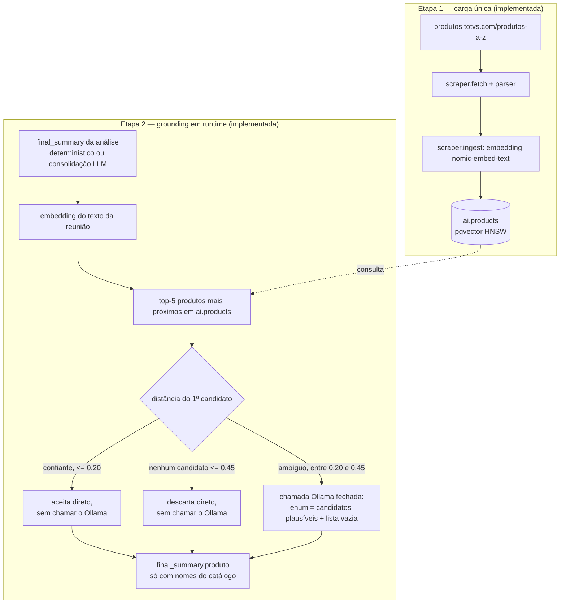

# Catálogo de produtos TOTVS: coleta e grounding da IA

Data: 2026-09-07. Registra a arquitetura decidida para resolver um problema
concreto: a IA de análise de reuniões pode citar um produto TOTVS que não
existe, ou atribuir a um produto uma característica de outro, porque hoje
nada no pipeline consulta uma lista real de produtos. O documento cobre as
duas etapas do trabalho — a etapa 1 (coleta do catálogo) e a etapa 2 (a IA
escolher produto só a partir do catálogo, com distância e modelo dividindo a
decisão) já estão implementadas e testadas.

## Visão geral



A etapa 1 resolve "quais produtos existem de verdade". A etapa 2 resolve
"a IA só pode citar um desses produtos, nunca um nome inventado".

---

## Etapa 1 — Coleta do catálogo (implementada)

### Por que existe

Sem uma fonte de verdade, o campo `produto` da análise dependia de duas
coisas: o modelo LLM escrevendo um nome livre, ou um regex fixo no código com
uma lista pequena e hardcoded de produtos (`TotoCRM`, `TOTVS ERP/CRM/Fluig/
Protheus/Datasul/RM/WMS`, `DataSuite`, `DataSoup`, `PD4000`). Qualquer produto
fora dessa lista curta, ou qualquer alucinação do modelo, passava direto para
o dashboard sem checagem.

### O que foi implementado

- `ia/scraper/fetch.py` — busca `https://produtos.totvs.com/produtos-a-z/`
  com `httpx` e um User-Agent de navegador comum. Confirmado manualmente que
  a página é renderizada no servidor (WordPress); não precisa de browser
  headless.
- `ia/scraper/parser.py` — extrai nome, descrição e URL de cada
  `<article class="produtos-az-item">`. Aceita URLs em `/produto/` e
  `/aplicativo/` (produtos completos e apps móveis complementares). Deduplica
  por conteúdo (`nome + descrição`, case-fold), não por URL — o catálogo real
  lista "App Meu RH" duas vezes, em `/produto/totvs-rh/app-meu-rh/` e em
  `/aplicativo/app-meu-rh/`; as duas URLs redirecionam para a mesma página
  canônica, então é o mesmo produto duas vezes, não dois produtos.
- `ia/scraper/ingest.py` — para cada produto, gera embedding com
  `generate_embedding` (o mesmo client Ollama já usado pelo resto do
  serviço, não uma implementação paralela) e insere em `ai.products`. Uma
  falha em um produto não aborta o lote: é registrada e o loop continua.
- `ia/scraper/main.py` — CLI (`python -m scraper.main`). É uma carga única,
  não um job de sincronização: não roda em agenda, não faz upsert, e recusa
  rodar de novo se `ai.products` já tiver linhas, a menos que `--force` seja
  passado. Isso evita duplicar os 302 produtos por engano.
- `ia/src/app/models/product.py` + `ia/migrations/versions/0006_products.py`
  — tabela `ai.products` (nome, descrição, conteúdo, `source_url` único,
  `embedding vector(768)`, índice HNSW com `vector_cosine_ops`), criada só
  por Alembic, como todo o resto do schema do projeto.
- `ia/scraper/search_sample.py` — script manual de conferência: embeda uma
  pergunta e mostra os 5 produtos mais próximos por distância de cosseno,
  usando exatamente o padrão já validado em
  `rag_service.search_analysis_chunks`.

### Validado com dado real

302 produtos únicos carregados e testados: uma busca por "software para
gestão empresarial" trouxe Fábrica de Software, Minha Gestão de Lojas,
Assistente Digital DMS by Simova, TOTVS Gestão de Receitas e App Meu Imóvel,
todos semanticamente coerentes com a pergunta.

### Como rodar (ambiente local, a partir da raiz do repo)

```sh
docker compose up -d postgres ollama
sh ia/install-model.sh
docker compose build ia-service
docker compose run --rm ia-service alembic upgrade head
docker compose run --rm ia-service python -m scraper.main
docker compose run --rm ia-service python -m scraper.search_sample "software para gestão empresarial"
```

Para recarregar do zero: `TRUNCATE ai.products;` (ou derrubar o volume do
Postgres) e rodar `scraper.main` de novo sem `--force` — a tabela vazia já
libera a carga normalmente.

---

## Etapa 2 — Grounding da resposta da IA (implementada)

### Onde o problema acontece hoje

Levantamento no código de análise encontrou quatro pontos onde um produto
chega ao `final_summary` sem nunca consultar um catálogo real:

1. `llm_service.py::_extract_deterministic_chunk_points` — regex fixo com a
   lista curta de nomes citada acima.
2. `analysis_service.py::_extract_source_facts` — se detecta "CRM" no texto,
   insere literalmente a string fixa `"TotoCRM / CRM de automação de força
   de vendas"` como produto, mesmo sem o catálogo confirmar esse nome.
3. `generate_chunk_summary` (chamada Ollama por chunk) — o schema
   `CHUNK_SUMMARY_SCHEMA` aceita texto livre depois de `PRODUTO:` em
   `pontos_chave`; o modelo pode escrever qualquer nome.
4. `consolidate_summaries` (chamada Ollama de consolidação, quando há mais
   de um chunk e a consolidação determinística está desativada) — o campo
   final `produto` também é texto livre, sem enum nem validação.

### O padrão já existente que resolve isso

O mesmo problema já foi resolvido no código para `motivos_churn` e
`motivos_oportunidade`: em vez de texto livre, o schema JSON enviado ao
Ollama restringe a resposta a um `enum` de códigos válidos. O modelo não
consegue fisicamente devolver um código fora da lista, porque o Ollama
valida a resposta contra o schema antes de devolver. A etapa 2 aplica a
mesma ideia a produto, com uma diferença: o enum não é fixo no código (como
os motivos), e sim montado dinamicamente a partir do resultado de uma busca
vetorial no catálogo.

### Fluxo decidido

1. Depois que o `final_summary` de uma análise está pronto — pelo caminho
   determinístico (`build_compact_final_summary`) ou pelo caminho de
   consolidação por LLM (`consolidate_summaries`), tanto faz — gerar **um**
   embedding a partir do texto da reunião (os pontos `PRODUTO:` já coletados
   nos chunks, ou o campo `produto` livre da consolidação quando não há
   nenhum ponto `PRODUTO:`).
2. Buscar os **5 produtos mais próximos** em `ai.products` por distância de
   cosseno (mesmo padrão de `scraper/search_sample.py` e de
   `rag_service.search_analysis_chunks`).
3. A distância decide os casos óbvios, sem gastar chamada nenhuma ao Ollama:
   - candidato mais próximo com distância **<= 0.20** (`product_grounding_
     confident_distance`): aceito direto, é claramente o produto certo;
   - nenhum candidato com distância **<= 0.45** (`product_grounding_
     plausible_distance`): descartado direto, nada é parecido o suficiente
     para valer a pena perguntar;
   - caso contrário (zona ambígua, entre os dois limiares): candidatos
     plausíveis demais para descartar, próximos demais entre si para a
     distância decidir sozinha — só aqui o Ollama é chamado.
4. Na zona ambígua, monta um schema JSON cujo `enum` são só os candidatos
   ainda plausíveis (nunca os 5 inteiros, e nunca os já descartados) mais a
   opção de lista vazia. Uma chamada Ollama fechada decide quais desses
   candidatos a reunião realmente menciona.
5. O resultado **substitui** `final_summary["produto"]`, independente de
   qual caminho de consolidação gerou o valor anterior. Os hardcodes dos
   pontos 1 e 2 listados acima deixaram de ser a fonte de verdade para esse
   campo — o ponto 2 foi removido, por inserir um nome fixo não confirmado
   pelo catálogo.

Resultado: a IA nunca escreve um nome de produto "da cabeça" — só pode
escolher entre nomes que existem de fato na tabela `ai.products`, com a lista
vazia como resposta legítima quando nenhum produto catalogado for
identificado.

### Por que distância decide sozinha nos extremos, e o modelo só decide no meio

A primeira versão implementada mandava sempre os 5 candidatos para uma
chamada Ollama fechada, em toda análise. Isso foi revisto para um modelo
híbrido pelo mesmo motivo que já limita outras decisões deste pipeline ao
modelo pequeno disponível: o `consolidation_model` (`gemma3:1b` por
padrão) já tem uma fraqueza documentada exatamente nesse tipo de tarefa —
escolher dentre poucas opções fechadas. O comentário de
`trust_declared_motives`, em `core/config.py`, registra que esse mesmo
modelo, ao classificar motivos de churn/oportunidade dentre um catálogo
fechado, "enumera o catálogo em vez de escolher" e chegou a marcar todos os
cinco códigos de churn para uma demonstração de CRM. Depender inteiramente
desse modelo para decidir produto correria o mesmo risco: ele podia devolver
os 5 candidatos como "identificados" em vez de filtrar de verdade.

A distância de cosseno já resolve os casos óbvios sozinha, sem esse risco:

- um candidato muito próximo do texto é, na prática, o produto certo —
  perguntar ao modelo não muda a resposta, só gasta uma chamada e expõe o
  resultado à mesma fraqueza de "escolher tudo";
- candidatos todos muito distantes não são o produto de forma nenhuma — não
  vale a pena nem perguntar.

O modelo só é chamado na faixa intermediária, onde a distância sozinha
realmente não decide (candidatos plausíveis e próximos entre si, como "TOTVS
RH" e "App Meu RH" para o mesmo trecho) — e mesmo aí, só vê os candidatos que
a distância já filtrou como plausíveis, nunca a lista inteira de 5, o que
reduz o espaço em que ele poderia "escolher tudo" por segurança.

Os dois limiares (`product_grounding_confident_distance = 0.20` e
`product_grounding_plausible_distance = 0.45`) são valores iniciais, não
calibrados ainda contra reuniões reais — na mesma situação em que
`chat_similarity_threshold = 0.55` (usado no RAG do chat, equivalente a
distância 0.45) estava antes de ser medido contra uso real. Ficam como
configuração (`core/config.py`) justamente para serem ajustados depois que o
grounding rodar contra reuniões e catálogo reais.

### Por que essa chamada roda uma vez por análise inteira, não por chunk

Essa foi uma decisão explícita, motivada por sensibilidade de hardware, não
por economia de chamadas por si só. O `docker-compose.yml` já documenta esse
limite no próprio serviço Ollama:

```yaml
OLLAMA_NUM_PARALLEL: 1
# Kept at 1: raising it to 2 to hold gemma3 and nomic-embed together
# measured 0.9s better, inside the noise, and on a 7.2 GB host that
# extra resident model is what pushes the machine into swap.
OLLAMA_MAX_LOADED_MODELS: 1
```

O host de referência tem 7.2 GB de RAM disponível para o Ollama, e já roda
no limite: dois modelos residentes ao mesmo tempo (geração + embedding)
mede como pior, não melhor, porque empurra a máquina para swap. O restante
do pipeline já é desenhado em torno dessa restrição —
`ANALYSIS_WORKER_CONCURRENCY=1`, `CHUNK_PROCESSING_CONCURRENCY` limitado a 1
ou 2, e o comentário em `chunk_num_predict` sobre calibrar o orçamento de
saída por causa do custo de reprocessar uma resposta truncada.

Uma chamada de classificação fechada por *chunk* multiplicaria o número de
chamadas ao Ollama pelo número de chunks da reunião — uma reunião de 15
chunks (o teto de `MAX_LLM_CHUNKS`) passaria a pagar 15 chamadas extras,
todas competindo pelo mesmo modelo carregado, na mesma máquina que já mede
degradação ao tentar manter dois modelos residentes. Rodar uma vez por
análise mantém o custo da etapa 2 constante (1 chamada extra, não N),
independente do tamanho da reunião, ao custo de uma granularidade um pouco
menor: reuniões muito longas que discutem vários produtos distintos ficam
limitadas a escolher dentre os 5 candidatos mais próximos do texto da
reunião como um todo, em vez de um top-5 por trecho. Essa perda de
granularidade foi aceita conscientemente em troca de manter o pipeline
estável no hardware disponível.

### Status

Implementado:

- `src/app/services/product_service.py` — `find_candidate_products` (busca os
  top-5 em `ai.products` por cosine distance, cada um com sua distância) e
  `ground_products` (a lógica híbrida: aceita o mais próximo direto se estiver
  dentro de `product_grounding_confident_distance`, descarta tudo direto se
  nenhum candidato estiver dentro de `product_grounding_plausible_distance`,
  e só chama o Ollama, com o subconjunto plausível, na faixa intermediária.
  Devolve lista vazia sem tocar o banco quando não há texto para buscar, e sem
  chamar o Ollama quando a busca não retorna candidatos — nunca deixa a
  decisão "sem produto" cair para uma suposição do modelo).
- `llm_service.product_classification_schema` + `llm_service.classify_products`
  — o schema fechado com `enum` dinâmico e a chamada Ollama que só pode
  devolver nomes que estavam entre os candidatos recebidos.
- `analysis_service._product_grounding_query` — decide o texto de busca a
  partir dos pontos `PRODUTO:` já coletados nos chunks, caindo para o campo
  `produto` livre da consolidação quando não há nenhum ponto `PRODUTO:`.
- A chamada roda dentro de `process_analysis_summaries`, depois de qualquer
  um dos três caminhos de consolidação (determinístico, chunk único ou LLM) e
  antes de `complete_missing_fields`, substituindo `final_summary["produto"]`
  pelo resultado. Só é pulada quando não há nenhum indício de produto para
  buscar (texto de busca vazio) — nesse caso `produto` não é tocado, evitando
  gastar uma chamada de embedding e uma chamada Ollama à toa.
- Os dois hardcodes descritos acima foram removidos de
  `analysis_service._extract_source_facts`: nenhum nome de produto é mais
  inserido a partir de palavras-chave (`CRM`, `DataSuite` etc.) sem passar
  pelo catálogo.
- Quatro flags novas em `core/config.py`: `PRODUCT_GROUNDING_ENABLED` (default
  `true`; desligar volta ao `produto` bruto da consolidação, sem grounding),
  `PRODUCT_GROUNDING_TOP_K` (default `5`), `PRODUCT_GROUNDING_CONFIDENT_
  DISTANCE` (default `0.20`) e `PRODUCT_GROUNDING_PLAUSIBLE_DISTANCE`
  (default `0.45`).
- Testado: `llm_service` (schema e chamada fechada, com Ollama mockado via
  `httpx.MockTransport`), `product_service` (os quatro ramos da lógica
  híbrida — aceite confiante, rejeição sem candidato plausível, arbitragem só
  entre os plausíveis, e catálogo vazio — todos com a busca mockada; a query
  vetorial em si depende de Postgres real, como o resto da busca por
  similaridade no projeto) e `analysis_service` (dois testes de ponta a
  ponta: grounding substituindo o palpite livre por um nome do catálogo, e
  grounding pulado quando a reunião não menciona nada parecido com produto).

Validado com Ollama e catálogo reais, de ponta a ponta: a transcrição de
referência de `ia/tests/test_analisar.py` (a mesma reunião cujos comentários
no código já citam CRM/ERP) foi analisada com `ai.products` populado, e o
log `product_grounding=true produtos=['TOTVS Backoffice - Linha Datasul']`
confirma o resultado. É um caso de teste particularmente bom: os chunks
mencionam o mesmo produto de três formas distorcidas por transcrição de fala
(`TotoCRM`, `DataSoup`, `DataSuite`, visíveis em `evidencias`), e o grounding
resolveu as três para um único nome real do catálogo — exatamente o problema
original que motivou este trabalho, sem inventar nem repetir a variação
ouvida na fala.

`product_service.ground_products` também loga qual dos três ramos decidiu
cada caso, antes do resultado final ser conhecido:

```text
product_grounding_branch=confident distance=0.1234 produto=TOTVS Backoffice - Linha Datasul
product_grounding_branch=rejected closest_distance=0.5821
product_grounding_branch=arbitration candidatos=['TOTVS RH', 'App Meu RH']
```

Isso permite auditar, por análise, se a decisão veio da distância sozinha
(confiante ou rejeitada) ou da arbitragem pelo modelo — útil justamente para
calibrar os limiares (`product_grounding_confident_distance`/
`product_grounding_plausible_distance`) contra dado real no futuro.

---

## Como testar (para quem já tem o modelo do Ollama instalado)

Pressupõe um ambiente que nunca rodou este branch antes — banco vazio, sem
o problema de colisão de migração que apareceu neste durante o
desenvolvimento (arquivos já vêm renumerados corretamente: `0004`
chunk_passages, `0005` fulltext, `0006` products).

```sh
docker compose up -d --build
docker compose ps   # confirme ia-service Up, sem reiniciar
docker compose run --rm ia-service python -m scraper.main
```

`docker compose up -d --build` já roda `alembic upgrade head` sozinho, como
parte do `CMD` do container, antes do Uvicorn subir — não precisa rodar de
novo à parte. Só vale rodar `docker compose run --rm ia-service alembic
upgrade head` manualmente se quiser isolar um erro de migração de um
possível crash do Uvicorn.

O `scraper.main` recusa rodar de novo se `ai.products` já tiver linhas —
normal se alguém já populou esse banco antes; não precisa `--force` num
banco novo.

Para testar o grounding com a reunião de referência:

```sh
docker compose exec ia-service pip install --quiet requests
docker compose exec ia-service python tests/test_analisar.py
```

Copie o `analysis_id` da resposta e acompanhe até `status` virar
`DASHBOARD_READY` ou `DONE`:

```sh
docker compose exec ia-service python -c "
import time, jwt, requests
from datetime import datetime, timedelta, timezone
from src.app.core.config import settings

analysis_id = 'COLE_AQUI_O_ANALYSIS_ID'
token = jwt.encode(
    {'sub': 'test@kolia.com', 'exp': datetime.now(timezone.utc) + timedelta(minutes=30)},
    settings.secret_key, algorithm=settings.algorithm,
)
headers = {'Authorization': f'Bearer {token}'}

while True:
    r = requests.get(f'http://localhost:3000/analises/{analysis_id}', headers=headers)
    data = r.json()
    print(data['status'], '-', data.get('progress_percent'), '%')
    if data['status'] in ('DASHBOARD_READY', 'DONE', 'FAILED', 'FAILED_ANALYSIS'):
        print(data['final_summary']['produto'])
        break
    time.sleep(10)
"
```

E confira a decisão no log:

```sh
docker compose logs ia-service | grep product_grounding
```

Resultado esperado, com o catálogo real: `produto` com um nome real de
`ai.products` (ou lista vazia, se a reunião não mencionar nada
suficientemente próximo de um produto catalogado) — nunca mais um nome
inventado como `"TotoCRM / CRM de automação de força de vendas"`.
